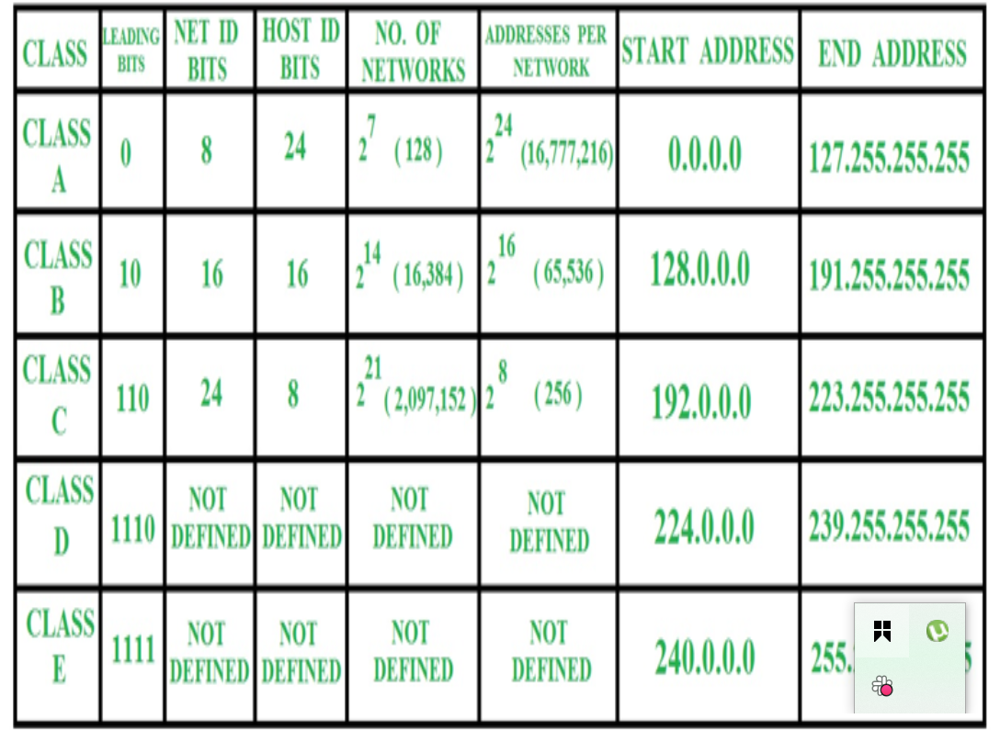

# ip-cidr-notation

### _ip addressing_

The IP address consist of 4 - octets with 8 bits per octet.

An IP address has two parts:

The network address is a series of numerical digits pointing to the network's unique identifier 
The host address is a series of numbers indicating the host or individual device identifier on the network.

### _Subnetting & Subnetmask_

Subnetting is the practice of dividing a network into two or smaller networks. It increases routing efficiency, which helps to enhance the security of the network and reduces the size of the broadcast domain.

Subnet Mask is a 32 bits address used to distinguish between a network address and a host address in IP address. A subnet mask identifies which part of an ip address is thenetwork address and the host address.

### _CIDR_

Classless Inter-Domain Routing (CID) is an IP address allocation method that improves data routing efficiency on the internet. Organizations use CIDR to allocate IP addresses flexibly and efficiently in their networks.

### _ip-address classes_

In a classful addressing system, each class supported a fixed number of devices:
Class A supported 16,777,214 hosts
Class B supported 65,534 hosts
Class C supported 254 hosts

The classful arrangement was inefficient when allocating IP addresses and led to a waste of IP address spaces.

### _Advances topics in IP addressing_

This phase talks about the following; NAT, VPN, advanced routing and DNS.
